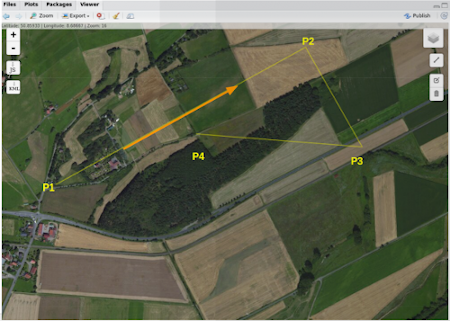
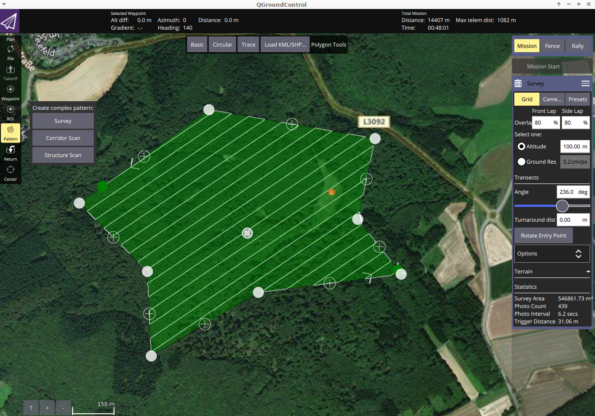
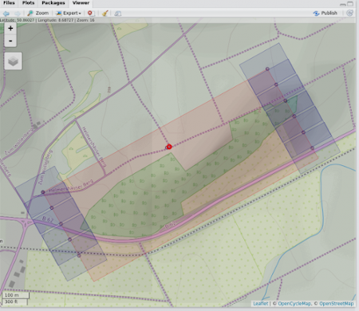

```{r echo=FALSE}
knitr::opts_chunk$set(collapse = TRUE)
```
# Introduction
Unmanned Aerial Vehicle R based Mission Planning


The [uavRmp](https://github.com/gisma/uavRmp) package is designed 
for UAV autonomous mission planning. In the first place it is a simple and open source planning tool for planning survey flights of low budget drones based on ```R```. It provide an easy workflow for planning autonomous 
surveys including battery-dependent task splitting and save departures and approaches of each monitoring chunks.

The range of usage of these kinds aof aerial photography is widespread from Digital Surface Models (DSM), Digital Elevation Models (DEM), orthophotos, altitude point clouds to landuse/landscape classification, NDVI forest structure classifications and so on… 


## Note
WARNING: Take care! There are still a lot of construction zones around. This package is far beyond to be in a mature state. Please implement a double check systems while planning and performing autonomous flight missions. You will have a lot of chances to make a small mistake what may yield in a damage of your UAV or even worse in involving people, animals or non-cash assets. 

Check your risk - use parachute systems and, even if everything is running like a charm, keep alert!

## Supported UAV platforms

Up to now it has been dedicated to low budget rtf-UAVs as the DJI Phantom (up to P4) series and the Pixhawk flightcontroller family. However the current and future support will focus on Pixhawk based UAVs only.

The open UAV community is focused on the PixHawk autopilot unit and the [MissionPlanner](http://qgroundcontrol.com/downloads/) or [QGroundcontrol](https://ardupilot.org/planner2/) software. Both are well documented and provide APIs and easy to use GUIs. Nevertheless they are missing planning capability (APM Planner) or a terrain following autonomous flight planning tool, that is also dealing with battery-dependent task splitting and save departures and approaches (MissionPlanner) yet. Other commmercial competitors like the powerful [ugcs](https://www.ugcs.com/) software package are still lacking an advanced capability for generating smooth and save surface following flight tasks for low AGL altitudes.

The ```uavRmd``` bridges this gap and generates ```MAVLINK``` format compliant mission files that can be uploaded to the Pixhawk controller using an integrated function or externally by any Ground Control Station software.

DJI: The reason using DJI UAVs is because of their absolute straightforward usage. Everybody can fly with a DJI but the price for this simplicity is a hermetically closed system. Only the Litchi app provides in addition to a cloud based mission planer an offline/standalone interface to upload a CSV formated way point file for autonomous flights to the Phantom.

PixHawk/3DR Solo: The open UAV community is focused on the PixHawk autopilot unit and the Mission Planner software. It is well documented and several APIs are provided. Nevertheless a terrain following autonomous flight planning tool is not available. '''uavRst''' supports the ```MAVLINK``` common message format that can be uploaded directly on the Pixhawk controller using Ground Control Station software or the ```upload2Solo``` function.


## The family

The package family consists of 4 parts:

  * flight planning `uavRmp`
  * remote sensing `uavRrst`
  
## Installation

The most easiest way to obtain a fairly good runtime enviroment is to setup Linux as a dual boot system or in a VB.  For using some of the the Solo related functions you need to install the [dronekit](https://github.com/dronekit/dronekit-python) python libs in addition.

A full list of necessary libaries and binaries beyond ```R``` will soon be provided.


To install from ```github```  you need to have installed the ```devtools``` package.

```S
devtools::install_github("gisma/uavRmp", ref = "master")
```

If you want to install all dependencies use:

```S
devtools::install_github("gisma/uavRmp", ref = "master", dependencies = TRUE)
```

# The core planning tools

The core planning tools ```makeAP``` (make area plan) and ```makeTP``` (make target plan) are creating either intermediate flight control files for the DJI Phantom 3x UAVs or ready to upload control files for the Pixhawk based UAVs like the 3DR Solo. The intermediate DJI control files are expected to be used with the proprietary [Litchi](https://flylitchi.com/) flight control app, while the Pixhawk/3DR Solo files are using the ```MAVLINK``` common message format.

The basic idea is to provide an easy to use workflow for controlling rtf UAVs on autonomous survey missions.  

## The types of mission tasks
 
To define a flight area you have to provide either 4 Points (or 3 lines). You may take more complex vectors like a multi point polygon, but only the first 4 coordinates x1, x2, x3 and x4 (the latter for the launching position) are used in exactly this order. If you take a rectangle the 4th corner coordinate will be the launching point. The concept is looking like the following sketch:
    
    x2------x3           x2-------x1
    | a                 /
    |                  /
    |   x4            / x4
    |  /             / /
    x1/             x3/
   
This coordinates the length of the line and the angle are used to calculate extend and parallels of the flight plan according to the flight altitude, overlap etc. NOTE: The flight direction depends on the order of the points. 

If ```flightPlanMode = "tracks"```. The result look like below.

    #--#  #-->             #-----#
    |  |  |               /    
    |  |  |              #-----#
    |  |  |                   /
    #  #--#         <--#-----#

If ```flightPlanMode = "waypoints"``` The result is an equal spatial distribution of way points:
 
    #--#  #-->             #--#--#
    |  |  |               /    
    #  #  #              #--#--#
    |  |  |                   /
    #  #--#         <--#--#--#

```waypoints``` is optimal for autonomous flights under calm conditions in complex terrain because the camera takes a picture at every way point.

```track``` is optimal for relatively plain areas and automatically triggered picture capturing 
 DJI only: Automatically picture capturing in a time interval works only within the range of the remote control because the UAV needs a trigger signal for taking pictures.
 
## Terrain following task

 The argument ```followSurface = TRUE``` will switch from fixed AGL flight altitude into a terrain following flight altitude.

NOTE: You have to be aware that the DJI UAV is calibrating the altitude at the launch position in the field! So you need either a correct coordinate altitude or a high resolution DEM to get a good(!) estimation of the launch position and altitude.
 
You must choose a clearly defined and reliable launching position both in the map and the field. If one fails, we made the experience that the aircraft probably will hit the terrain...

 
Let us assume a defined flight altitude of 50m. According to the launching point altitude the UAV will act like the following sketch shows:

     ............... x_(uav)_x ........... UAV started at 30m altitude results in
                                             a "real" flight altitude of 30m + 50m => 80m

                    ___60m____
                   |          |
           30m _x__|          |
          ____|               |___
      ___|                        |____

                   ___60m____
        ..........|          |............ UAV started at 0 m altitude results in
               ___|          |___          "real" flight altitude of 50m above 0m
          ____|                  |
      ___|                       |__x__ 0m

To avoid negative impacts from the Phantom 3 auto-calibration, the launch altitude is used to correct the flight altitude according to:

     maximumAltitude_of_surveyArea + altitude_of_launchposition
   
So the adapted flight altitude is always seen as the flight altitude above the highest terrain altitude:

     ...................................... real altitude of UAV: 110m

                   ___60m____
                  |          |
           30m _x_|          |___
          ____|                  |
      ___|                       |______

To get a fixed scale flight the launch altitude is used to correct the flight altitude according to:

     ```maximumAltitude of surveyArea + altitude of launch position```

With the setting of ```terrainfollowing = true``` this is calculated for each way point. So the adapted flight altitude looks like:

                   ..........
                  |          |
              ....|          |....
         ....|     ___60m____    |
    ....|         |          |   |....... real altitude of UAV: 50m
           30m _x_|          |___
          ____|                  |
      ___|                       |___x___ 0m


# Basic mission planning workflow

## Overview of the task

This recipe deals with the effective and safe planning of an autonomous flight. This provides basic information about the used hardware and software as well as supplemental data and nice to haves.

## Skills you will learn 

The basic workflow of planning a good aerial and target oriented flight mission. In the extended version you find some more explanations and hints for improving your planning. 

Even if you can assume the use of uavs for autonomous flights as somehow “operational”, you should always keep in mind that avoiding negative impacts is a result of responsible and focused planning.

     Please keep in mind that autonomous UAVs can harm the the pilot and environment. 

## Things you need 

  - [R](https://www.r-project.org) 
  - [uavRmp](https://github.com/gisma/uavRmp) package
  - Digital Surface Model  (DSM) data 
  - DJI Phantom/Pixhawk UAV
  - For DJI only [Litchi](https://flylitchi.com/) flight App    
  - For Pixhawk [QGroundcontrol](http://qgroundcontrol.com/)
  - Time to work it out

## General Workflow 


  - Identify the area, digitize/type the coords of 3 corners and the launching position
  - Adjust the flight parameters to your needs and generate flight control files
  - Convert and upload the mission control files either directly to your tablet/smartphone or alternatively via the Litchi cloud.
  - Make an extensive preflight check
  - Fly the mission
  
## Basic examples 

The first example will introduce you to the basic usage and folder structure.


     Purpose: Survey flight over flat terrain to generate DSM and orthophoto. It is described for the Phantom 3 and Litchi only. 

Addressed issues:

  - Create a reliable DSM for near surface retrieval of high resolution pictures
  - Create an orthophoto for visual inspection of POIs

## The short way 

Digitize the 3 corner points of an area you want to map and in addition as fourth point the position of the planned UAV launch.  Save it to  //firstSurvey.kml//. 
```{r "setup", include=FALSE}
require("knitr")
knitr::opts_knit$set(root.dir = tempdir())
```

```{R, eval=FALSE}
   require(uavRmp)
   # get example DEM data
   fn <- system.file("extdata", "mrbiko.tif", package = "uavRmp")
   fa <- system.file("extdata", "flightarea.kml", package = "uavRmp")
   # preset = "uav" supress all not necessary tools
   vecDraw(mapCenter = c(50.855,8.691),preset="uav")
  
   # Use the digitized data (assumed to be named "firstSurvey.json")
   # and the example DEM to calculate a flight control file
   fp <- makeAP(surveyArea = fa,
                demFn = fn)

```

NOTE: The first two points determine the flight angle and direction the second and third coordinate determine the width of the area. 

If you want so save it on your SD card, open the [Litchi Mission](https://flylitchi.com/) website and click on the button ```Missions->Import```. Next navigate to the control file ```firstsurvey_1001.csv``` (you’ll find it in the folder ```projectDir/mission/date/control```). For exporting it choose ```Missions->Save``` and navigate/upload it to your missions subfolder of the Litchi app. That’s it.

Even more simple is the option to connect with the litchi cloud. While you are logged in with the same account it is synchronizing the data as soon as you start the litchi app.

## The long way


### Digitizing the survey area

#### Build in `vecDraw` function

We want to plan a flight in a more or less flat terrain in the upper Lahn-valley. First load the libraries and next start the small digitizing tool that is provided in ''uavRmp''. 

    You may take any other tool to digitize the survey area as well as you may type the coordinates on Stdin.

```{r, eval=FALSE}
 # load uavRmp
 require(uavRmp)

 # start digitizing tool with preset = "uav" for a reduced toolbar
 # see ?leafDraw for more information
 vecDraw(mapCenter = c(50.855,8.691),preset="uav")
```
  

Feel free to digitize - similar to the above figure - the four points needed:

  - P1, P2, P3 define the extend and angles of the mission area. 
  - P1 is the starting point of the survey
  - Flight direction angle and along distance is defined by P1->P2
  - P2->P3 defines the cross distance
  - P4 is the launching point. Try to digitize it very carefully because of getting an optimal launch altitude.

For an optimal deliniation of the flight area, please keep in mind some hints:
  - It makes sense to put the launching position somewhere near or within the proposed survey area with respect to an optimal visibility to the UAV and the shortest possible distance for the radio controller to keep in contact with the UAV.
  - It is helpful to fly **along** structures with necessary climbs at the end of each track. It saves energy and in most cases the climbs can be controlled easier.
  - Try to identify your launching point ** very carefully** and ** most reliable**. The UAV is taking this position as a home (reference) point for both position and altitude.

Finish digitizing and save it as a KML file. Take care to add the correct extensions  ''.kml'' (the ''makeAP()'' function is requiring the correct extension). In the current example save it as a kml file named ''firstSurvey.kml''.

#### Missionplanner or Qgroundcontrol survey feature
We want to plan a flight in a structured terrain in the upper Lahn-valley. Start the qGroundcontrol and navigate to Mission tab and open Pattern->Survey. Start digitizing a pattern as you want and also fill in the values on the right sided menus for camera angel overlap and so on. 


Save this at an appropriate folder. To use this planning file you have to set in `makeAP` the switch:

```{r, eval=FALSE}
 useMP = TRUE
```


### Calling makeAP 

#### Working directories and other structural defaults 
 
There are a lot of optional arguments available that helps to control the generation of an autonomous flight plan. In this first use case we keep it as simple as possible. First we will focus the arguments to organize the project.  All results will be stored in a fixed folder structure. The root folder is set by the argument ```projectDir```. e.g. ''~/proj/uav''. The current working directory will then be generated from the ```locationName``` and is always a subfolder of the ''projectDir''. So in this case it is set to ''firstSurvey''.  The resulting folder for a specified location in a speciefied project is then ''~/proj/uav/firstsurvey''. According to the date of planning the following subfolder structure is set up. For the mission control files a folder named ''control'' is used, the log files are saved in the ``log`` folder the temporary data sets are stored in a folder called ''run''.

PLEASE NOTE: Optionally all used data files are copied to a folder called ''data'', which is located directly under the ''projectDir'' folder.

The project structure will look like the figure.

  

#### The used arguments

''flightAltitude'' is set to the (legal) maximum of 100m, ''flightPlanMode'' is set to ''track'' and finally a DEM of this area with 20m resulution is used to retrieve the altitude of the launching point. If we use the example data we first have to convert them to a valid GeoTiff file.

```{r, eval=FALSE}

  # get example DEM data
 fn <- system.file("extdata", "mrbiko.tif", package = "uavRmp")
 fa <- system.file("extdata", "flightarea.kml", package = "uavRmp")

 fp<-makeAP(surveyArea=fa,
            maxSpeed =35,
            demFn = fn)
```

The script generates:

  * R objects for visualisation
  * log file 
  * flight control file(s). 

All three of them are important even if a quick inspection of the generated objects is most of the time sufficient. The log file dumps the all important parameters of the calculated mission. Most important the calculated mission speed and picture rate based on an estimation of the mission time. 

Using the ```mapview``` package  you can easily visualize the results. The below example shows the footprints of the images (blue), surveyArea (red), turnpoints of track (blue circles) and the launch position (red). 

```{r, eval=FALSE}
 require(mapview)
 mapview(fp[[5]],color="red", alpha.regions =0.1,lwd=0.5)+
 mapview(fp[[1]],lwd=1,cex=4)+
 mapview(fp[[3]],color="red",cex=5)+
 mapview(fp[[4]],color="darkblue", alpha.regions =0.1,lwd=0.5)
```

  

### Export to the flight app 


DJI:

Open [Litchi Mission](https://flylitchi.com/) and click on the button ''Missions->Import'' and navigate to the control file firstSurvey_1001.csv. To export it click ''Missions->Save''. 

Solo 
```solo_upload("export_1001_solo.waypoints")```

Ready to take off - that’s your first flight plan!

# Field Guide

## Planning your Survey

It is most important that you setup your survey with an appropriate overlap for reliable stitching results. If the overlap is too small or vice versa you fly too fast you will get poor or no results. Same is with the flight altitude and the camera settings. Below you find suggested values.

ASL Alt m|GP8MP3+ (cm)|GP12MP3+ (cm)|DJI P3 4K (cm)|MAPIR 2 (cm)
------------- | ------------- | ------------- | ------------- | ------------- 
15|1.08|0.9|0.63|0.56
30|2.16|1.8|1.27|1.03
75|5.4|4.5|3.2|2.53
100|7.2|6.0|4.25|3.38
Ground Resolution of typical cameras

## Suggested Overlap

Front Overlap 80%,  Side Overlap 60%

## Camera Speed

Depending on the product and manufactor of the cameras you have to deal with different speeds. NOTE: Only the speed that can be continously achieved is taken into account. Currently a picture rate of 2 sconds is the maximum in speed.

**It is strongly recommended that you use (if available) an autonoumous camera timer (time lapse) for controlling the pictures interval.**

## Flight Speed

On average the fasted SD Cards will be able to achieve an average speed of about 2 seconds/JPEG (Raw + JPEG 3.5 seconds) image. As a result taking pictures every 2 seconds will be a sporty attempt. The Flight speed recommodations are meeting this needs. Let us assume you fly a task with the field of view (FOV) of the DJI 4K camera at 35 meters above ground level (AGL). To derive the maximum flight distance from picture to picture in meter for the given overlap you have to calculate:

$FOV*agl*(1-overlap) = 1,71*35*0,2 = 12 m$ 

If you can take a picture every 2 seconds your max speed is: $12 m / 2 s  = 6 m/s$

## Rule of thumb

For  JPG pictures: $0,15 * agl (RAW; 0,07 * agl)$
For a 100 meter AGL flight you should set the speed to a maximum of:
 $0,15 * 100 = 15 m/s (54 km/h)$ 
For a flight of 35m agl this is will be roughly 5,25 m/s
## DEM/DSM Data
If you fly in an wide open flat area you do not need additional data. But if you fly in middle range mountains, forests or similar complex structures you will need a digtal surface model (DSM/DEM) for retrieving an optimal and safe flight path. 

## Weather
Actually you also should check the weather.
Forget about flying with wind speed above 4 Beaufort - the UAV is **not** a falcon.

## Workflow in the field   
1. Plan you r flight with an adequate planning tool at home and control it in the field (see examples, check your flightplan)
2. Setup your Remote Controller 
3. Setup your controlling device
4. Setup your UAV
5. Setup your safety system (use a parachute!)
6. Setup your camera(s)
7. Start RC
8. Start UAV
9. Start Camera 
10. Load Task 
11. Fly Task
As simple this seems it is full of pitfalls. Therefore we would like to provide some checklist:

## Pretask Check
* UAV 
    + batteries fully charged
    + remote control charged 
    + props 
    + cables
    + parachute
    + cleanup MicroSD cards
    + charge camera(s) 
    + configure camera(s)
    + charger
    + minute book
    + power bank

* Tools
    + Tools for the UAV
    + Tape, glue etc.
    + Table, chairs etc.

* Survey
    + Survey is checked
    + Task is stored on controller (app)
    + offline maps loaded

* Legal stuff
    + insurance valid
    + common flight permission
    + specific permissions
    + necessary to inform flight security authorithy
    + necessary to inform local air control

