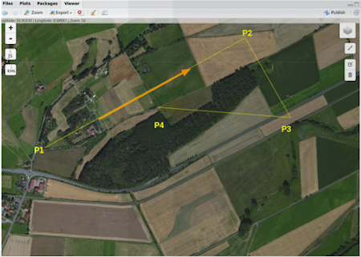

```{r echo=FALSE}
knitr::opts_chunk$set(
  collapse = TRUE,
  comment = "#>"
)
```

# Introduction

Unmanned Aerial Vehicle R based Mission Planning

The [uavRmp](https://github.com/gisma/uavRmp) package is designed for UAV autonomous mission planning. It provides an open source `R` workflow for generating reproducible autonomous survey missions, including terrain-aware flight planning, battery-dependent task splitting, and safe departure and approach sections for each mission chunk.

The range of applications for this kind of aerial photography is broad. Typical products include Digital Surface Models (DSM), Digital Elevation Models (DEM), orthophotos, altitude point clouds, land use and landscape classifications, NDVI products, and forest structure classifications.

When `uavRmp` was originally developed, consumer UAV mission planning tools offered only limited support for terrain-aware mapping flights. This has changed. Since the introduction of the new Litchi Hub in 2025, standard DJI mapping missions can often be planned directly in the browser using Litchi's Area Mapping and 3D planning tools. Litchi also supports user-provided elevation data through DEM import workflows.

Therefore, the role of `uavRmp` has shifted. For ordinary rectangular or polygon-based mapping flights, direct planning in Litchi Hub may now be sufficient. `uavRmp` remains relevant for specialised workflows where flight lines, terrain-following behaviour, mission splitting, or survey geometry must be computed reproducibly from external GIS and `R` data rather than drawn manually in a web interface.

## Note

WARNING: Take care. This package is not a mature fully automated flight safety system. It generates mission planning data, but it does not replace field checks, legal checks, UAV-specific safety procedures, or pilot responsibility.

Always implement a double-check workflow when planning and performing autonomous flight missions. Small mistakes in coordinates, altitude references, terrain models, camera settings, or launch position definition may damage the UAV or may endanger people, animals, infrastructure, and other assets.

Check your risk, use appropriate safety equipment, and keep visual and operational control of the UAV even if the mission appears to run correctly.

## Supported UAV platforms

Up to now, `uavRmp` has mainly supported low-budget ready-to-fly UAVs such as the DJI Phantom series up to the Phantom 4 and the Pixhawk flight controller family. Future support should primarily focus on Pixhawk-based UAVs.

The open UAV community is centred around the Pixhawk autopilot ecosystem and Ground Control Station software such as [Mission Planner](https://ardupilot.org/planner2/) and [QGroundControl](https://qgroundcontrol.com/downloads/). These tools are well documented and provide APIs as well as graphical mission planning interfaces. However, depending on the workflow, they may still lack convenient terrain-following survey planning with battery-dependent task splitting and safe departure and approach sections. Commercial alternatives such as [UgCS](https://www.ugcs.com/) provide advanced mission planning capabilities, but they are not open source and may not fit low-budget or fully reproducible `R`/GIS workflows.

`uavRmp` bridges this gap by generating mission files that can be exported to UAV control software. For Pixhawk-based UAVs, `uavRmp` generates MAVLink-compatible mission files that can be uploaded using Ground Control Station software. For older 3DR Solo workflows, the package also provides upload functionality.

DJI UAVs are attractive because they are easy to use and widely available. The price of this simplicity is a comparatively closed ecosystem. Historically, Litchi was one of the few practical tools that allowed users to import CSV-formatted waypoint files for autonomous DJI flights. With the newer Litchi Hub, many standard mapping missions can now be planned directly in the browser. The `uavRmp` Litchi export should therefore be understood as a compatibility and special-purpose interface for computed missions rather than as the default workflow for all DJI mapping flights.

Pixhawk-based UAVs remain the more open platform for reproducible and scriptable mission planning. `uavRmp` supports MAVLink-compatible output that can be used with Pixhawk-based controllers via Ground Control Station software. For the outdated 3DR Solo platform, use the `solo_upload()` function where applicable.

## Installation

The easiest way to obtain a suitable runtime environment is to use Linux, either as a native system, a dual boot system, or in a virtual machine. For some of the older 3DR Solo related functions, the [dronekit](https://github.com/dronekit/dronekit-python) Python libraries may also be required.

A full list of required libraries and external binaries beyond `R` depends on the selected workflow. Advanced workflows may require additional geospatial libraries and command line tools.

The recommended way to install the development version from GitHub is `pak`:

```{r eval=FALSE}
install.packages("pak")
pak::pak("gisma/uavRmp")
```

If `pak` is already installed, use:

```{r eval=FALSE}
pak::pak("gisma/uavRmp")
```

This installs the package and resolves its dependencies. The older `devtools::install_github()` workflow is no longer recommended as the primary installation method, but may still work in existing development environments:

```{r eval=FALSE}
devtools::install_github("gisma/uavRmp", ref = "master", dependencies = TRUE)
```

# The core planning tools

The core planning tools `makeAP()` (make area plan) and `makeTP()` (make target plan) create either intermediate flight control files for DJI UAVs or ready-to-upload mission files for Pixhawk-based UAVs such as the 3DR Solo. The intermediate DJI control files are intended for import into the proprietary [Litchi](https://flylitchi.com/) flight control ecosystem, while the Pixhawk/3DR Solo files use MAVLink-compatible mission formats.

The basic idea is to provide an easy-to-use and reproducible workflow for controlling ready-to-fly UAVs on autonomous survey missions.

For current DJI workflows, it is important to distinguish between two use cases. Standard mapping missions can often be planned directly in Litchi Hub using its built-in Area Mapping and 3D planning tools. `uavRmp` remains useful when the flight plan is generated from external geospatial data, when a custom terrain model is required, when mission splitting must be controlled explicitly, or when the mission must be regenerated reproducibly from `R` code.

## The types of mission tasks

To define a flight area, provide either four points or three connected lines. More complex vector objects such as multi-point polygons may be used as input, but only the first four coordinates `x1`, `x2`, `x3`, and `x4` are used in exactly this order. The last coordinate is assumed to be the launch position. If a rectangle is used, the fourth corner coordinate will be treated as the launch point. The concept is shown in the following sketch:

    x2------x3           x2-------x1
    | a                 /
    |                  /
    |   x4            / x4
    |  /             / /
    x1/             x3/

The coordinates, line length, and angle are used to calculate the extent and parallel flight lines according to flight altitude, image overlap, and related parameters.

NOTE: The flight direction depends on the order of the points.

If `flightPlanMode = "track"`, the result may look like this:

    #--#  #-->              #-----#
    |  |  |                /
    |  |  |               /
    |  |  |              /
    |  |  |              #-----#
    |  |  |                   /
    |  |  |                  /
    |  |  |                 /
    #  #--#       <--#-----#

If `flightPlanMode = "waypoints"`, the result is an equal spatial distribution of waypoints:

    #--#  #-->              #--#--#
    |  |  |                /
    #  #  #               #
    |  |  |              /
    #  #  #              #--#--#
    |  |  |                   /
    #  #  #                  #
    |  |  |                 /
    #  #--#       <--#--#--#

`waypoints` is optimal for autonomous flights under calm conditions in complex terrain because the camera takes a picture at every waypoint.

`track` is optimal for relatively flat areas and automatically triggered picture capture.

**NOTE:** DJI only: automatically triggered picture capture in a time interval works only within the range of the remote control because the UAV needs a trigger signal for taking pictures.

## Terrain following task

The argument `followSurface = TRUE` switches from a fixed flight altitude relative to the launch altitude to a terrain-following flight altitude.

**NOTE:** By default, many UAVs calibrate their altitude at the launch position in the field. Therefore, a reliable launch position and a suitable terrain model are critical. You need either a correct coordinate altitude or a high-resolution DEM to obtain a usable estimate of the launch position altitude.

Choose a clearly defined and reliable launch position both in the map and in the field. If the launch altitude or launch position is wrong, the aircraft may fly at an unsafe altitude relative to the terrain.

Assume a defined flight altitude of 50 m. Relative to the launch point altitude, the UAV will behave like this:

     x_()_x >>> ............................ UAV started at 30 m altitude results in
       ^                                     a real flight altitude of 30 m + 50 m => 80 m
       ^               ___60m____
       ^              |          |
       ^      30m _x__|          |
       ^     ____|               |___
     x_()_x_|                        |______

                      ___60m____
    x_()_x >>> ......|          |..........  UAV started at 0 m altitude results in
      ^           ___|          |___          a real flight altitude of 50 m above 0 m
      ^          |                  |
      ^      ____|                  |
    x_()_x _|                       |_______

To avoid negative impacts from UAV auto-calibration, the launch altitude can be used to correct the flight altitude according to:

    maximum altitude of survey area + altitude of launch position

In this case, the adapted flight altitude is treated as the flight altitude above the highest terrain altitude:

          x_()_x >>> ..................... real altitude of UAV: 110 m
            ^
            ^      ___60m____
            ^     |          |
        _ x_()_x__|   30m    |___
    ____|                        |
    |                            |______

With terrain-following enabled, the correction is calculated for each waypoint. The adapted flight altitude then follows the terrain more closely:

                   ..........
                  |          |
              ....|          |....
         ....|     ___60m____    |
    ....|         |          |   |....... real altitude of UAV: 50 m
           30m _x_|          |___
          ____|                  |
      ___|                       |___x___ 0 m

# Basic mission planning workflow

## Overview of the task

This recipe deals with the effective and safe planning of an autonomous flight. It provides basic information about the used hardware and software as well as supplemental data and useful planning hints.

## Skills you will learn

You will learn the basic workflow for planning an aerial and target-oriented flight mission. Extended workflows provide additional options for improving planning quality and for adapting missions to terrain, camera settings, and battery constraints.

Even if autonomous UAV flights may appear operationally routine, avoiding negative impacts requires responsible and focused planning.

    Please keep in mind that autonomous UAVs can harm the pilot, other people, animals, infrastructure, and the environment.

## Things you need

- [R](https://www.r-project.org)
- [uavRmp](https://github.com/gisma/uavRmp) package
- Digital Surface Model (DSM) or Digital Elevation Model (DEM) data
- DJI Phantom or Pixhawk-based UAV
- For DJI workflows: [Litchi](https://flylitchi.com/) flight app or Litchi Hub
- For Pixhawk workflows: [QGroundControl](https://qgroundcontrol.com/downloads/) or [Mission Planner](https://ardupilot.org/planner2/)
- Time for planning, checking, and field validation

## General workflow

- Identify the area.
- Digitize or enter the coordinates of three survey-area corners and the launch position.
- Adjust the flight parameters to the mission requirements.
- Generate the flight control files.
- Convert and upload the mission control files either directly to the tablet or smartphone, via Ground Control Station software, or via the Litchi cloud.
- Perform an extensive preflight check.
- Fly the mission under safe and legal field conditions.

## Basic examples

The first example introduces the basic usage and folder structure.

    Purpose: survey flight over flat terrain to generate a DSM and an orthophoto.
    The example is described for the Phantom 3 and Litchi workflow.

Addressed issues:

- Create a reliable DSM for near-surface retrieval of high-resolution pictures.
- Create an orthophoto for visual inspection of points of interest.

## The short way

Digitize the three corner points of the area that should be mapped and add the planned UAV launch position as the fourth point. Save the result as `firstSurvey.kml`.

```{r setup, include=FALSE}
require("knitr")
knitr::opts_knit$set(root.dir = tempdir())
```

```{r eval=FALSE}
require(uavRmp)

# get example DEM data
fn <- system.file("extdata", "mrbiko.tif", package = "uavRmp")
fa <- system.file("extdata", "flightarea.kml", package = "uavRmp")

# preset = "uav" suppresses unnecessary digitizing tools
vecDraw(mapCenter = c(50.855, 8.691), preset = "uav")

# Use the digitized data and the example DEM to calculate a flight control file
fp <- makeAP(
  surveyArea = fa,
  demFn = fn
)
```

NOTE: The first two points determine the flight angle and direction. The second and third coordinate determine the width of the area.

If you want to use the generated mission with Litchi, open the [classic Litchi Mission Hub](https://flylitchi.com/) and choose `Missions -> Import`. Then navigate to the generated control file, for example `firstsurvey_1001.csv`, which is usually located in `projectDir/mission/date/control`. To store the mission in the cloud, choose `Missions -> Save`.

Alternatively, use the newer [Litchi Hub](https://hub.flylitchi.com/) for browser-based mission planning and mission management. For standard mapping missions, Litchi Hub may now be sufficient without using `uavRmp`. Use the `uavRmp` export when the mission was computed externally, for example from a custom DEM, a GIS-derived survey geometry, or a reproducible `R` workflow.

When working with user-provided elevation data in Litchi, check the currently supported DEM workflow carefully. The classic Litchi Mission Hub documents DEM import via `Missions -> Import DEM` and supports Esri ASCII Grid files (`.asc`) in the WGS-84 coordinate system. DOMs, orthophotos, or GeoTIFF-based map overlays should not be confused with a terrain-following DEM unless the current Litchi workflow explicitly uses them as elevation data.

## The long way

### Digitizing the survey area

#### Built-in `vecDraw()` function

We want to plan a flight in a more or less flat terrain in the upper Lahn valley. First load the required package and then start the small digitizing tool provided by `uavRmp`.

    You may also use any other tool to digitize the survey area or type the coordinates manually.

```{r eval=FALSE}
# load uavRmp
require(uavRmp)

# start digitizing tool with preset = "uav" for a reduced toolbar
# see ?leafDraw for more information
vecDraw(mapCenter = c(50.855, 8.691), preset = "uav")
```



Digitize four points similar to the figure above:

- P1, P2, and P3 define the extent and angles of the mission area.
- P1 is the starting point of the survey.
- Flight direction angle and along-track distance are defined by P1 -> P2.
- Cross-track distance is defined by P2 -> P3.
- P4 is the launch position. Digitize it very carefully because it is used to estimate the launch altitude.

For an optimal delineation of the flight area, keep the following hints in mind:

- It is useful to place the launch position near or within the proposed survey area, while maintaining good visibility to the UAV and keeping the radio-control distance short.
- It is often helpful to fly along terrain structures and place necessary climbs at the end of each track. This can save energy and may make climbs easier to control.
- Identify the launch point very carefully and reliably. The UAV may use this position as the home reference for both position and altitude.

Finish digitizing and save the result as a KML file. Take care to add the correct `.kml` extension. The `makeAP()` function requires the correct extension. In the current example, save the file as `firstSurvey.kml`.

### Calling `makeAP()`

#### Working directories and other structural defaults

`makeAP()` provides several optional arguments to control the generation of an autonomous flight plan. In this first use case, we keep the workflow as simple as possible.

First, we focus on the arguments that organize the project. All results are stored in a fixed folder structure. The root folder is set by the argument `projectDir`, for example `~/proj/uav`. The current working directory is generated from `locationName` and is always a subfolder of `projectDir`. If `locationName` is set to `firstSurvey`, the resulting location folder is `~/proj/uav/firstSurvey`.

According to the date of planning, additional subfolders are created. Mission control files are written to a folder named `control`. Log files are saved in the `log` folder. Temporary data are stored in a folder called `run`.

PLEASE NOTE: Optionally, all used data files are copied to a folder called `data`, which is located directly under the `projectDir` folder.

The project structure will look like the figure below.


#### The used arguments

In this example, `flightAltitude` is set to the legal maximum of 100 m, `flightPlanMode` is set to `track`, and a DEM of the area with 20 m resolution is used to retrieve the altitude of the launch point. If the example data are used, they are read directly from the package.

```{r eval=FALSE}
# get example DEM data
fn <- system.file("extdata", "mrbiko.tif", package = "uavRmp")
fa <- system.file("extdata", "flightarea.kml", package = "uavRmp")

fp <- makeAP(
  surveyArea = fa,
  maxSpeed = 35,
  demFn = fn
)
```

The script generates:

- R objects for visualisation,
- a log file,
- flight control file(s).

All three outputs are important, although a quick inspection of the generated objects is often sufficient during initial planning. The log file stores important mission parameters, including calculated mission speed and picture rate based on an estimation of the mission time.

Using the `mapview` package, the results can be visualized easily. The example below shows the image footprints, survey area, turnpoints of the track, and launch position.

```{r eval=FALSE}
require(mapview)

mapview(fp[[5]], color = "red", alpha.regions = 0.1, lwd = 0.5) +
  mapview(fp[[1]], lwd = 1, cex = 4) +
  mapview(fp[[3]], color = "red", cex = 5) +
  mapview(fp[[4]], color = "darkblue", alpha.regions = 0.1, lwd = 0.5)
```


# Current practical relevance of the Litchi export

The Litchi export should now be understood as a compatibility and special-purpose interface rather than as the default planning workflow for all DJI mapping flights.

Use direct Litchi Hub planning when:

- the survey area can be drawn or imported as a simple mapping polygon,
- the required flight is a standard photogrammetry grid,
- overlap, speed, gimbal angle, and capture settings can be configured directly in Litchi,
- Litchi's available elevation and preview functions are sufficient.

Use `uavRmp` before Litchi when:

- flight planning depends on a custom high-resolution DEM,
- terrain-following altitude logic must be computed explicitly,
- survey lines are derived from GIS analysis,
- the mission must be reproducible from R code,
- flight geometry must be generated automatically for many sites,
- the terrain or object surface has high relief energy and manual browser-based planning is insufficient.

In short, Litchi Hub now covers many standard mapping and 3D planning tasks directly. `uavRmp` remains useful where the flight plan is not merely drawn, but computed from geospatial data.

[1]: https://flylitchi.com/help "Help - Litchi"
