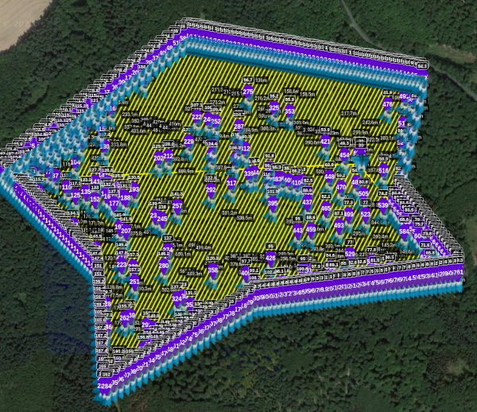
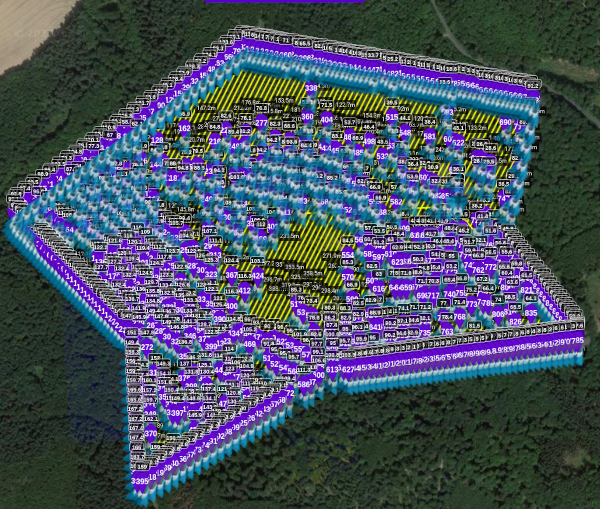

# Planning the Flight task with the Missionplanner or Qgroundcontrol survey feature

We want to plan a flight in a structured terrain in the upper Lahn-valley. Start the QGroundcontrol and navigate to Mission tab and open Pattern->Survey. Start digitizing a pattern as you want and also fill in the values on the right sided menus for camera angel overlap and so on. 


Save this at an appropriate folder. To use this planning file you have to set in `makeAP` the switch:


``` r
 useMP = TRUE
```


The planning with QGroundControl is much more powerful and comfortable than the simple planning with uavRmp. However, if you want to use some features like near-surface flights or more important a survey planning for DJI/Litchi, some parameters have to be set very carefully to make this export usable. 
Especially the Litchi export needs some care. 
Not all parameters from the Qgroundcontrol settings are taken over. Crucial is:

 * Set correct camera parameterization
 * choose `calc above terrain` and a reasonable `tolerance` filter (<=5) 

With the parameters: `horizonFilter`, `followSurfaceRes`, `altFilter` the behavior of the smoothing of the flight curve is set. It makes sense to keep the values the same at first. If the `followSurfaceRes` is set bigger than the distance of the single flight lines it will be automatically reduced.  

By default  `noFiles` is set to one. Due to the modern UAVs it is strongly recommended to keep it so. If you want to calculate single tasks you may set it to the number you need. However the task splitting is switched off which is useful for the modern DJI UAVs because you can use every waypoint in as a manual starting point for the continuation of the task after a battery change.

**Note:** For a problem-free terrain contour flight it is obligatory to set the parameter `above_ground = FALSE`.

The example below shows a meaningful example for an Air 2S DJI and a 30m ASL flight over beech wood with default settings.


``` r
demFn <- system.file("extdata", "mrbiko.tif", package = "uavRmp")
tutorial_flightArea <- system.file("extdata", "tutdata_qgc_survey30m.plan", package = "uavRmp")
fp <- makeAP(projectDir = tempdir(),
             surveyArea = tutorial_flightArea,
             useMP = TRUE,
             above_ground = FALSE,
             demFn = demFn,
             uavType = "dji_csv" 
             )
```

The result looks like this in Litchi.

  


It is easy to see that there are major errors in the transmission.

These resuls from the (a) a complex outer hull of the structure and that b) the turning points which are necessary to maintain the lateral overlap are filtered out in the DSM analysis. 
There are some simple ways to overcome this structural problem:


1. increase the distance of synthetic waypoints:  `followSurfaceRes = 2` 
2. in doubt choose the same value for the argument that controls the the rolling filter.: ` horizonFilter = 2`
3. adapt the number of waypoints to your needs e.g..: `altFilter = 5.0`
1. increase the argument buf_mult to e.g.: ` buf_mult = 3`

So adding a extended turning point tolerance (`buf_mult`) the results looks like below:


``` r
demFn <- system.file("extdata", "mrbiko.tif", package = "uavRmp")
tutorial_flightArea <- system.file("extdata", "tutdata_qgc_survey30m.plan", package = "uavRmp")
fp <- makeAP(projectDir = tempdir(),
             surveyArea = tutorial_flightArea,
             useMP = TRUE,
             buf_mult = 3,
             above_ground = FALSE,
             demFn = demFn,
             uavType = "dji_csv" 
             )
```
  


Modifying the terrain following control arguments  `followSundrfaceRes`, `horizonFilter` and `altFilter` will yield in a much more detailed control file:


``` r
demFn <- system.file("extdata", "mrbiko.tif", package = "uavRmp")
tutorial_flightArea <- system.file("extdata", "tutdata_qgc_survey30m.plan", package = "uavRmp")
fp <- makeAP(projectDir = tempdir(),
             surveyArea = tutorial_flightArea,
             useMP = TRUE,
             buf_mult = 3,
             followSurfaceRes = 2, 
             horizonFilter = 2, 
             altFilter = 5,
             above_ground = FALSE,
             demFn = demFn,
             uavType = "dji_csv" 
             )
```
  
